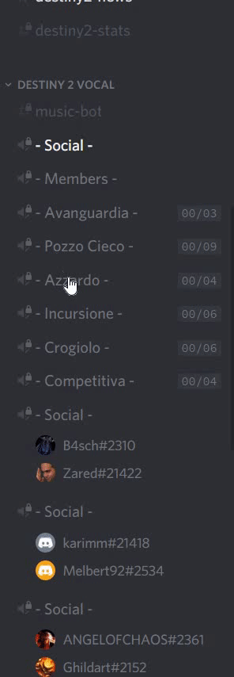

# Mimas

A discord bot to manage automatically voice channels.

## Features

Mimas will keep your Discord server tidy and clean, giving your community a neat user experience.

Channels will be automatically created.

At any given time there will be an empty voice channel available, distinct by name.

Your channels order will be preserved.

Your user will easily find their friends or create seamlessly new channels thanks to Mimas.

Unnecessary channels will be removed automatically.

See it in action!

## Add Mimas to your Discord

[Invite Mimas to your Discord](https://discord.com/oauth2/authorize?client_id=500602853098782752&scope=bot&permissions=1040) and follow the instructions.

You'll be asked to select your Discord server and grant Mimas **Read Messages** permissions.

## Permissions

Grant Mimas the following permissions in any category you desire:

- Manage Channel
- Read Text Channels & See Voice Channels

## Built With

- [TypeScript](https://www.typescriptlang.org/)
- [Discord.js](https://discord.js.org/)

## License

This project is licensed under the MIT License - see the [LICENSE.md](LICENSE.md) file for details

## Thanks to

- [Discord](https://discordapp.com/) staff for providing public APIs
- [Discord.js](https://discord.js.org/) for providing a JS framework
- [DeadElle](https://github.com/deadelle) for inspiration, product suggestions, and invaluable testing

## Help

If you don't understand any passage you can open an issue here asking for info.
